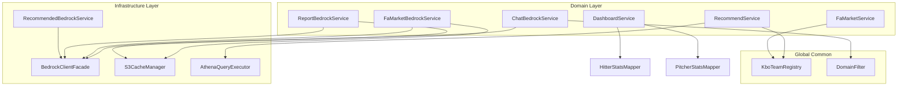

# Design Document: Backend Refactoring

## Overview

본 설계 문서는 더그아웃(Dugout) 백엔드의 8개 Code Smell을 체계적으로 리팩토링하기 위한 기술 설계를 정의한다. 핵심 목표는 코드 중복 제거, 단일 책임 원칙 적용, 에러 처리 일관성 확보, 성능 안정성 개선이다.

현재 아키텍처에서 식별된 주요 문제점:
- **Bedrock 호출 중복**: `ChatBedrockService`, `FaMarketBedrockService`, `ReportBedrockService`, `RecommendedBedrockService` 4곳에서 동일한 payload 구성 / InvokeModelRequest 빌드 / response 파싱 로직이 반복
- **팀 매핑 분산**: `FaMarketService.convertTeamNameToId()` if/else 체인, `RecommendService.FULL_TEAM_NAMES` 상수 등 동일 매핑이 여러 곳에 하드코딩
- **DashboardService 비대화**: `getUserDashboard()` ~90줄, `getTeamDailyStats()` ~100줄로 테스트·유지보수 어려움
- **에러 처리 비일관**: 일부 서비스는 fallback 문자열 반환, 일부는 RuntimeException throw
- **S3 캐싱 보일러플레이트**: `ReportBedrockService.init()`, `FaMarketBedrockService.init()` 에서 거의 동일한 JSON 파싱+캐싱 패턴 반복
- **도메인 키워드 하드코딩**: `ChatBedrockService.isBaseballQuestion()` 내 비야구 키워드 리스트가 코드에 직접 내장
- **Athena 무한 폴링**: `RecommendService.waitForQuery()` 에 타임아웃 없음
- **DTO flat 구조**: `PredictionResponseDto` 에 타자/투수 30+개 필드가 혼합

### 설계 원칙

| 원칙 | 적용 방법 |
|------|-----------|
| DRY (Don't Repeat Yourself) | Bedrock Facade, S3 Cache Manager, KBO Team Registry로 중복 제거 |
| SRP (Single Responsibility) | DashboardService 메서드 분리, 매퍼 클래스 추출 |
| OCP (Open/Closed) | 에러 전략 인터페이스, 외부 설정 기반 Domain Filter |
| Fail-Fast | 파라미터 검증, Athena 타임아웃 |

## Architecture

### 패키지 구조 (리팩토링 후)

```
com.dev.dugout
├── domain/
│   ├── chat/service/
│   │   └── ChatBedrockService (→ BedrockClientFacade 위임)
│   ├── player/
│   │   ├── dto/
│   │   │   └── PredictionResponseDto (HitterStats, PitcherStats 내부 객체)
│   │   └── service/
│   │       ├── FaMarketBedrockService (→ BedrockClientFacade + S3CacheManager 위임)
│   │       └── ReportBedrockService (→ BedrockClientFacade + S3CacheManager 위임)
│   ├── team/ (신규: KboTeamRegistry Enum)
│   └── user/
│       ├── service/DashboardService (축소된 오케스트레이션)
│       └── mapper/ (신규: HitterStatsMapper, PitcherStatsMapper)
├── global/
│   └── common/
│       ├── DomainFilter (신규)
│       └── S3CacheManager (신규)
└── infrastructure/
    └── aws/
        ├── bedrock/
        │   ├── BedrockClientFacade (신규)
        │   ├── BedrockErrorStrategy (신규 - enum)
        │   └── BedrockInvocationException (신규)
        ├── athena/
        │   ├── AthenaQueryExecutor (신규)
        │   └── AthenaTimeoutException (신규)
        └── service/
            └── RecommendedBedrockService (→ BedrockClientFacade 위임)
```

### 컴포넌트 의존성 다이어그램



## Components and Interfaces

### 1. BedrockClientFacade

```java
package com.dev.dugout.infrastructure.aws.bedrock;

@Service
@Slf4j
@RequiredArgsConstructor
public class BedrockClientFacade {

    private final BedrockRuntimeClient bedrockRuntimeClient;

    /**
     * Bedrock API 통합 호출 메서드
     *
     * @param modelId      모델 식별자 (예: "anthropic.claude-3-haiku-20240307-v1:0")
     * @param maxTokens    최대 토큰 수 (1 ~ 4096)
     * @param temperature  응답 다양성 (0.0 ~ 1.0)
     * @param systemPrompt 시스템 프롬프트 (nullable, 최대 10000자)
     * @param messages     메시지 리스트 (1개 이상)
     * @param errorStrategy 에러 처리 전략
     * @param fallbackValue fallback 전략 시 반환할 문자열 (nullable)
     * @param callerName   호출 서비스 식별명 (로깅용)
     * @return Bedrock 응답 텍스트
     */
    public String invoke(String modelId, int maxTokens, double temperature,
                         String systemPrompt, List<BedrockMessage> messages,
                         BedrockErrorStrategy errorStrategy, String fallbackValue,
                         String callerName) {
        // 1. 파라미터 검증 (Fail-Fast)
        // 2. JSON payload 구성 (anthropic_version, max_tokens, temperature, system, messages)
        // 3. InvokeModelRequest 빌드 및 호출
        // 4. response body에서 content[0].text 추출
        // 5. 예외 발생 시 errorStrategy에 따라 처리
    }
}
```

### 2. BedrockErrorStrategy (Enum)

```java
package com.dev.dugout.infrastructure.aws.bedrock;

public enum BedrockErrorStrategy {
    THROW_EXCEPTION,  // 예외 전파 (ChatBedrockService)
    RETURN_FALLBACK   // fallback 문자열 반환 (FaMarketBedrockService, ReportBedrockService, RecommendedBedrockService)
}
```

### 3. BedrockMessage (Record)

```java
package com.dev.dugout.infrastructure.aws.bedrock;

public record BedrockMessage(String role, String content) {}
```

### 4. BedrockInvocationException

```java
package com.dev.dugout.infrastructure.aws.bedrock;

public class BedrockInvocationException extends RuntimeException {
    private final String callerName;
    private final String modelId;

    public BedrockInvocationException(String callerName, String modelId, String message, Throwable cause) {
        super(message, cause);
        this.callerName = callerName;
        this.modelId = modelId;
    }
}
```

### 5. KboTeamRegistry (Enum)

```java
package com.dev.dugout.domain.team;

public enum KboTeamRegistry {
    SAMSUNG(1L, "삼성", "삼성 라이온즈"),
    DOOSAN(2L, "두산", "두산 베어스"),
    LG(3L, "LG", "LG 트윈스"),
    LOTTE(4L, "롯데", "롯데 자이언츠"),
    KIA(5L, "KIA", "KIA 타이거즈"),
    HANWHA(6L, "한화", "한화 이글스"),
    SSG(7L, "SSG", "SSG 랜더스"),
    KIWOOM(8L, "키움", "키움 히어로즈"),
    NC(9L, "NC", "NC 다이노스"),
    KT(10L, "kt", "kt wiz");

    private final Long id;
    private final String shortName;
    private final String fullName;

    // 조회 메서드
    public static Optional<Long> findIdByShortName(String shortName);
    public static Optional<String> findFullNameById(Long id);
}
```

### 6. S3CacheManager

```java
package com.dev.dugout.global.common;

@Component
@Slf4j
public class S3CacheManager {

    private final Map<String, Map<String, String>> cacheStore = new ConcurrentHashMap<>();

    /**
     * S3 경로에서 데이터를 로드하여 캐싱
     * @param cacheKey   캐시 식별 키 (예: "fa-master", "report-master")
     * @param jsonContent S3에서 읽은 JSON 문자열
     * @param keyExtractor JSON 배열의 각 요소에서 키를 추출하는 함수
     */
    public void load(String cacheKey, String jsonContent, Function<JSONObject, String> keyExtractor);

    /** 캐시에서 개별 항목 조회 */
    public Optional<String> get(String cacheKey, String itemKey);

    /** 특정 캐시 갱신 */
    public void refresh(String cacheKey, String jsonContent, Function<JSONObject, String> keyExtractor);

    /** 캐시 키 존재 여부 확인 */
    public boolean containsCache(String cacheKey);
}
```

### 7. DomainFilter

```java
package com.dev.dugout.global.common;

@Component
public class DomainFilter {

    @Value("${dugout.domain-filter.non-baseball-keywords:}")
    private List<String> nonBaseballKeywords;

    /**
     * 입력 문자열이 야구 도메인인지 판별
     * @return true: 야구 도메인, false: 비야구 도메인
     */
    public boolean isBaseballDomain(String input);
}
```

### 8. AthenaQueryExecutor

```java
package com.dev.dugout.infrastructure.aws.athena;

@Component
@Slf4j
@RequiredArgsConstructor
public class AthenaQueryExecutor {

    private final AthenaClient athenaClient;

    /**
     * Athena 쿼리 실행 후 결과가 준비될 때까지 폴링
     *
     * @param executionId 쿼리 실행 ID
     * @param maxAttempts 최대 폴링 횟수 (기본 60)
     * @param maxWaitSeconds 최대 대기 시간(초) (기본 30)
     * @param pollingIntervalMs 폴링 간격(밀리초) (기본 500)
     * @throws AthenaTimeoutException 타임아웃 시
     */
    public void waitForCompletion(String executionId, int maxAttempts,
                                  int maxWaitSeconds, long pollingIntervalMs);
}
```

### 9. DashboardService 분리 구조

리팩토링 후 `DashboardService`는 오케스트레이션만 담당하며, 실제 변환 로직은 매퍼 클래스로 추출한다.

```java
// 분리될 메서드 구조
public class DashboardService {
    // getUserDashboard() → 3개 private 메서드 호출로 축소
    private TeamRankSummaryDto fetchTeamRank(Team team);
    private List<NewsItemDto> fetchLimitedNews(Team team);
    private List<PlayerInsightDto> buildPlayerInsights(List<UserDashboard> selections);
}
```

```java
// 신규 매퍼 클래스
package com.dev.dugout.domain.user.mapper;

public class HitterStatsMapper {
    public static TeamDailyStatsResponseDto.PlayerStatDto toDto(DailyPlayerHitter hitter);
}

public class PitcherStatsMapper {
    public static TeamDailyStatsResponseDto.PlayerStatDto toDto(DailyPlayerPitcher pitcher);
}
```

### 10. PredictionResponseDto 구조 개선

```java
@Getter
@Builder
@JsonInclude(JsonInclude.Include.NON_NULL)
public class PredictionResponseDto {
    // 공통 필드
    private String name;
    private Integer backNumber;
    private String position;
    private String aiReport;

    // 포지션별 그룹화 (JSON 직렬화 시 플래트닝)
    @JsonUnwrapped
    private HitterStats hitterStats;

    @JsonUnwrapped
    private PitcherStats pitcherStats;

    @Getter @Builder
    @JsonInclude(JsonInclude.Include.NON_NULL)
    public static class HitterStats {
        private BigDecimal currAvg, predAvg, avgDiff, avgMin, avgMax;
        private BigDecimal currObp, predObp, diffObp, obpMin, obpMax;
        private BigDecimal currSlg, predSlg, diffSlg, slgMin, slgMax;
        private BigDecimal currOps, predOps, opsDiff, opsMin, opsMax;
        private Integer currHr, predHr, hrDiff, hrMin, hrMax;
    }

    @Getter @Builder
    @JsonInclude(JsonInclude.Include.NON_NULL)
    public static class PitcherStats {
        private BigDecimal probElite, rolePercentileTop;
        private Integer roleRank, roleTotal;
        private BigDecimal era2025, fip2025, ip2025, whip2025;
        private String role;
    }
}
```

## Data Models

### BedrockMessage

| 필드 | 타입 | 설명 |
|------|------|------|
| role | String | "user" 또는 "assistant" |
| content | String | 메시지 내용 |

### KboTeamRegistry Enum 데이터

| ID | 약칭 | 풀네임 |
|----|------|--------|
| 1 | 삼성 | 삼성 라이온즈 |
| 2 | 두산 | 두산 베어스 |
| 3 | LG | LG 트윈스 |
| 4 | 롯데 | 롯데 자이언츠 |
| 5 | KIA | KIA 타이거즈 |
| 6 | 한화 | 한화 이글스 |
| 7 | SSG | SSG 랜더스 |
| 8 | 키움 | 키움 히어로즈 |
| 9 | NC | NC 다이노스 |
| 10 | kt | kt wiz |

### S3CacheManager 내부 구조

```
cacheStore: ConcurrentHashMap<String, Map<String, String>>
  ├── "report-master" → { "pcode_123": "{...json...}", "pcode_456": "{...}" }
  └── "fa-master"     → { "pcode_789": "{...json...}", ... }
```

### AthenaQueryExecutor 설정 파라미터

| 파라미터 | 타입 | 기본값 | 설명 |
|----------|------|--------|------|
| maxAttempts | int | 60 | 최대 폴링 횟수 |
| maxWaitSeconds | int | 30 | 최대 대기 시간(초) |
| pollingIntervalMs | long | 500 | 폴링 간격(밀리초) |

### DomainFilter 외부 설정

```properties
# application.properties
dugout.domain-filter.non-baseball-keywords=주식,코인,부동산,날씨,맛집,레시피,쇼핑,영화,드라마,음악,정치,선거,의학,병원,법률,세금
```

