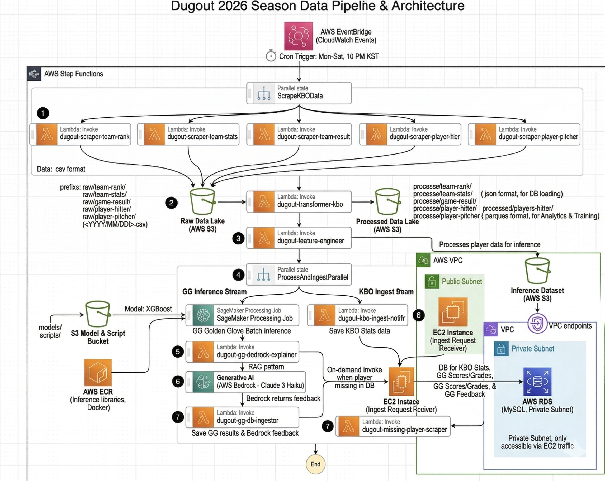

<div align="center">


# 더그아웃 (Dugout) — KBO 데이터 인사이트 플랫폼

> **"관중석이 아닌, 더그아웃의 시선으로."**  
> 10개 구단 모든 데이터의 중심. 실시간 트래킹부터 미래 성적 예측까지,야구를 꿰뚫는 새로운 시각.

</div>

---

## 📌 목차

1. [왜 이 프로젝트를 만들었나](#1-왜-이-프로젝트를-만들었나)
2. [서비스 소개](#2-서비스-소개)
3. [기술 스택 & 선택 이유](#3-기술-스택--선택-이유)
4. [시스템 아키텍처](#4-시스템-아키텍처)
   - 4-1. 데이터 파이프라인 (일별 크롤링 → DB)
   - 4-2. 선수 미래 성적 예측 ML 파이프라인
   - 4-3. FA 등급 분석 ML & GenAI 파이프라인
   - 4-4. Insight Engine (In-Memory RAG)
   - 4-5. 팀 추천 파이프라인
5. [AI/ML 모델링](#5-aiml-모델링)
6. [프로젝트 구조](#6-프로젝트-구조)
7. [기술적 의사결정 & 트러블슈팅](#7-기술적-의사결정--트러블슈팅)
8. [회고](#8-회고)

---

## 1. 왜 이 프로젝트를 만들었나

### 🔍 문제 인식

KBO 관련 데이터는 공식 홈페이지, 각종 커뮤니티, 뉴스 등 다양한 곳에 **분산**되어 있습니다.  
팬 입장에서 "이 선수가 올 시즌 얼마나 잘할까?", "FA 시장에서 이 선수 가치는?" 같은 질문에  
데이터 기반으로 답을 내려주는 **통합 플랫폼이 없었습니다.**

또한 야구를 처음 접하는 팬들에게는 **"내가 어느 팀을 응원해야 할까?"** 라는 물음 자체도 어렵습니다.

### 💡 해결 방향

> 단순 기록 조회를 넘어, **데이터 수집 → 정제 → 모델링 → 인사이트 제공** 전 과정을 직접 설계하고 구현한다.

- KBO 데이터를 **매일 자동 수집·정제**하여 DB에 적재
- **ML 모델 3종** (선수 성적 예측, FA 등급 분석, 골든글러브 예측) 으로 예측 인사이트 제공
- 예측 결과의 **근거를 GenAI로 자동 설명** (In-Memory RAG)
- 취향 데이터 기반 **팀 추천** 으로 새 팬 유입 유도

---

## 2. 서비스 소개

더그아웃은 3개의 대카테고리, 총 9개의 메뉴와 개인화 대시보드로 구성되어 있습니다.

### 📊 나의 대시보드
회원가입 시 선택한 응원 팀을 기반으로 **개인화된 홈 화면**을 제공합니다.

| 구성 요소 | 내용 |
|-----------|------|
| 팀 뉴스 | 내 팀의 최신 속보 및 이슈 |
| 경기 일정 & 결과 | 내 팀의 예정 경기 및 최근 결과 |
| 응원 선수 성적 | 내가 즐겨찾기한 선수의 미래 예측 기록 |
| 팀 타자 성적 | 내 팀 타자 전체 성적 한눈에 확인 |
| 팀 투수 성적 | 내 팀 투수 전체 성적 한눈에 확인 |

> 여러 사이트를 돌아다닐 필요 없이, 로그인 후 첫 화면에서 내 팀에 대한 모든 정보를 한 번에 확인할 수 있습니다.

### 🏟️ Game Data Center
| 메뉴 | 설명 |
|------|------|
| KBO 팀/성적 순위 | 10구단의 팀 순위, 팀 성적, 선수들의 성적을 한 눈에 확인  |
| 경기 일정 & 결과 | 전 구단 경기 일정 및 결과 확인 |
| 실시간 KBO 뉴스 | 구단별 주요 속보와 이슈 큐레이션 |

### 🤖 AI Predictive Insight
| 메뉴 | 설명 |
|------|------|
| 선수 미래 성적 예측 | 타율·OPS·엘리트 투수 등 시즌 종료 시점 성적 시뮬레이션 |
| 골든글러브 수상 예측 | 데이터 기반 수상 확률 산출 |
| FA 시장 등급 분석 | 예비 FA 선수의 가치와 리스크를 정량적으로 분석 |

### 🎉 Fan Experience
| 메뉴 | 설명 |
|------|------|
| 구단별 티켓 예매 | 각 구단 예매 사이트 직링 및 일정 알림 |
| 나의 팀 찾기 | 야구 취향 데이터를 분석해 가장 잘 맞는 구단을 추천 |
| 야구 용어 & 룰 가이드 | 초보부터 마니아까지, 야구를 구조적으로 이해하는 가이드 |

---

## 3. 기술 스택 & 선택 이유

### 🖥️ Frontend
| 기술 | 선택 이유 |
|------|-----------|
| **React** | 컴포넌트 기반 구조로 메뉴별 UI를 독립적으로 개발·관리하기 위해 선택 |
| **Tailwind CSS** | 유틸리티 클래스 기반으로 빠르게 반응형 UI를 구성. 별도 CSS 파일 없이 일관된 스타일 유지 |

### ⚙️ Backend
| 기술 | 선택 이유 |
|------|-----------|
| **Java 17 + Spring Boot 3.x** | 안정적인 서버 운영과 타입 안정성. 다수의 API 엔드포인트를 구조적으로 관리하기 위해 선택 |
| **JPA / QueryDSL** | 복잡한 선수·경기 데이터 조회를 타입 세이프하게 작성하기 위해 QueryDSL 병행 사용 |
| **JWT** | 사용자 인증 시 토큰을 HTTP 헤더에 포함시켜 요청마다 서버에서 검증하는 Stateless 인증 방식 구현 |

### 🤖 AI/ML/Data
| 기술 | 선택 이유 |
|------|-----------|
| **Python 3.14** | ML 생태계(scikit-learn, XGBoost, pandas, SHAP 등)가 가장 성숙한 언어 및 버전 |
| **XGBoost** | 모든 모델링에서 핵심 알고리즘으로 사용. 야구 데이터는 변수 간 관계가 단순한 직선 형태가 아니며 불확실성이 크기 때문에, 트리 기반 구조로 복잡한 비선형 패턴을 효과적으로 포착하기 위해 선택. 이상치(Outlier)에 강건하며, 자체 규제(Regularization) 기능으로 과적합을 방지해 일반화 성능이 높음 |
| **앙상블 (XGBoost + RandomForest + ExtraTrees)** | 선수 미래 성적 예측 과정에서 거포 타자와 컨택 타자 간 예측 오차 편차 문제가 발견됨. 컨택형 타자는 BABIP(인플레이 타구 비율) 의존도가 높아 운의 요소가 많이 개입되어 단일 모델로는 오차가 컸음. 여러 트리 기반 모델을 앙상블하여 특정 타자 유형에 편향되지 않는 안정적인 예측 성능을 확보 |
| **scikit-learn** | 앙상블 모델 구성 및 전처리 파이프라인 구현. 빠른 프로토타이핑 가능 |
| **SHAP** | 모델이 왜 이 예측을 했는지 설명 가능성(XAI) 확보. 단순 예측을 넘어 근거를 제공하기 위한 핵심 도구 |
| **BeautifulSoup** | KBO 데이터 크롤링에 사용. 정적 HTML 파싱에 적합하고 Python 생태계와 자연스럽게 연동 |

### ☁️ AWS Cloud
| 기술 | 선택 이유 |
|------|-----------|
| **EC2 (t2.micro)** | 서비스 서버 호스팅. 프리 티어 범위 내에서 운영 비용을 최소화하면서 실제 배포 환경을 경험하기 위해 선택 |
| **RDS** | 선수·경기·예측 결과 등 정형 데이터의 안정적인 영구 저장소 |
| **Amazon S3** | 대용량 KBO 원천 데이터 및 정제 데이터의 저비용 저장소 |
| **AWS Lambda** | 크롤링·정제·피처 엔지니어링·피드백 생성 등 파이프라인의 각 단계를 독립적인 함수로 구성. 서버 관리 없이 필요한 순간에만 실행되어 비용 효율적 |
| **AWS Step Functions** | 다수의 Lambda 함수를 병렬·순차 실행으로 조율하는 파이프라인 오케스트레이터. 각 단계의 성공·실패를 상태 머신으로 관리하여 재실행 및 에러 핸들링을 명확하게 처리 |
| **Amazon EventBridge** | Step Functions를 매일 일정 시각에 자동 트리거하는 cron 스케줄러. 별도 서버 없이 시간 기반 자동화 구현 |
| **Amazon ECR** | ML 모델 실행 환경을 Docker 이미지로 패키징하여 저장. 모델 환경의 재현성을 보장하고 Lambda 실행 시 일관된 환경 제공 |
| **AWS Glue** | 팀 추천 파이프라인에서 역대 10년치 팀 성적 데이터를 서버리스로 ETL 처리. 별도 Spark 클러스터 없이 운영 가능 |
| **Amazon Athena** | S3 데이터를 SQL로 직접 조회. 별도 DB 인스턴스 없이 분석 쿼리가 가능해 팀 추천 파이프라인 비용 절감 |
| **Amazon SageMaker** | ML 모델 학습 환경. 로컬 환경의 리소스 제약 없이 안정적인 학습 환경을 확보하기 위해 사용 |
| **Amazon Bedrock** | GenAI 기반 예측 근거 생성. 자체 모델 서빙 없이 Claude를 API 형태로 바로 연결 가능 |
| **Amazon CloudWatch** | 각 Lambda 함수와 Step Functions 실행 로그를 실시간 모니터링. 파이프라인 이상 감지 및 디버깅에 활용 |

### 🔧 DevOps
| 기술 | 선택 이유 |
|------|-----------|
| **GitHub Actions** | 코드 푸시 시 자동 빌드·배포 파이프라인 구성. 별도 CI/CD 서버 없이 GitHub 내에서 관리 가능 |
| **Nginx** | EC2 앞단의 리버스 프록시 서버. 포트 라우팅 및 정적 파일 서빙 역할 |
| **VPC** | 퍼블릭·프라이빗 서브넷을 분리하여 RDS 등 내부 리소스를 외부에서 직접 접근 불가능하도록 네트워크 격리 |

---

## 4. 시스템 아키텍처

### 4-1. 데이터 파이프라인 — 일별 크롤링 → DB + 골든글러브 예측

> **왜 이 구조인가?**  
> KBO 데이터는 경기 당일 갱신되므로 **매일 자동 수집**이 필수입니다.  
> 단순 스케줄러가 아니라 **Step Functions 상태 머신**으로 각 단계를 오케스트레이션하여  
> 특정 Lambda가 실패해도 재실행이 가능하고, 병렬 처리로 수집 시간을 단축했습니다.  
> 수집 → 정제 → 적재 / 모델 예측 갱신까지 전 과정이 하나의 자동화된 흐름으로 연결됩니다.



**파이프라인 실행 흐름**

```
EventBridge (cron)
    └─▶ Step Functions 트리거
            │
            ├─▶ [병렬 수집] Lambda × 5 (동시 실행)
            │       ├─ 팀 순위 크롤링
            │       ├─ 팀 성적 크롤링
            │       ├─ 경기 결과 크롤링
            │       ├─ 타자 성적 크롤링
            │       └─ 투수 성적 크롤링
            │
            └─▶ 정제 Lambda (수집 결과 통합 정제 → S3 저장)
                    │
                    ├─▶ [Branch A] 골든글러브 예측 갱신
                    │       ├─ 피처 엔지니어링 Lambda
                    │       ├─ 모델 추론 Lambda (ECR 이미지 기반)
                    │       └─ 피드백 생성 Lambda (Bedrock 연동)
                    │
                    └─▶ [Branch B] DB 적재
                            └─ Spring API 호출 Lambda → RDS 저장
```

- **EventBridge cron** 으로 매일 정해진 시각에 자동 트리거
- **5개 Lambda 병렬 실행**으로 수집 시간 단축. 각 함수는 독립적으로 실행되므로 하나의 실패가 전체에 영향을 주지 않음
- 정제 완료 후 **Branch A / B 로 분기**하여 모델 갱신과 DB 적재를 동시에 처리
- Branch A에서는 당일 누적 성적을 기반으로 골든글러브 예측을 재추론하고 Bedrock으로 피드백까지 자동 생성
- Branch B에서는 Lambda가 Spring REST API를 호출하여 RDS에 저장 — 직접 DB 접근 없이 기존 서버 계층을 통해 적재
- **CloudWatch** 로 각 Lambda 실행 로그 및 Step Functions 상태를 모니터링

---

### 4-2. 선수 미래 성적 예측 — ML & GenAI 파이프라인

> **왜 이 구조인가?**  
> 실시간으로 들어오는 당일 데이터로 추론하는 방식이 아닌, **시즌 전 10년치 역대 데이터를 학습**하여  
> 다음 시즌의 성적을 미리 예측하는 구조입니다.  
> 예측 결과는 RDS에 저장하고, SHAP 기반 설명 데이터는 S3 → Java 힙 메모리에 올려두어  
> 프론트 요청 시 **예측값 + 자연어 피드백을 한 번에 반환**하는 흐름으로 설계했습니다.


**모델 구성**

| 구분 | 예측 타겟 | 비고 |
|------|-----------|------|
| 타자 XGBoost | 타율, HR, OPS | 회귀 문제 |
| 투수 XGBoost | 다음 시즌 엘리트 등극 확률 | 분류 문제 |

> **왜 투수 모델을 ERA 회귀에서 분류 문제로 전환했나?**  
> ERA는 투수 실력만의 결과가 아닙니다.  
> 수비, 운, 타구의 질, 구장, 상황, 그리고 불펜의 승계주자까지 — 투수가 통제할 수 없는 요소가 너무 많이 섞여 있습니다.  
> 초기 ERA 회귀 모델은 이 노이즈를 감당하지 못하고 붕괴했고,  
> 타겟을 "다음 시즌 엘리트 등극 여부"로 전환하여 모델 안정성을 확보했습니다.

**파이프라인 실행 흐름**

```
[학습 단계 — 시즌 전 1회 실행]
10년치 KBO 역대 데이터
    └─▶ 피처 엔지니어링
            ├─▶ 타자 XGBoost 학습  →  예측 결과 RDS 저장
            │                      →  SHAP JSON 생성 → S3 업로드
            └─▶ 투수 XGBoost 학습  →  예측 결과 RDS 저장
                                   →  SHAP JSON 생성 → S3 업로드

[서비스 단계 — 프론트 요청 시]
프론트 요청 (선수 ID)
    └─▶ Spring API
            ├─▶ RDS에서 예측 결과 조회
            └─▶ Java 힙 메모리에서 SHAP JSON 조회
                    └─▶ Bedrock으로 자연어 피드백 생성
                            └─▶ 예측값 + 피드백 동시 반환 → 프론트
```

- 훈련은 시즌 전 **1회 실행**. 실시간 추론 없이 결과를 미리 저장해두는 배치 방식
- SHAP JSON은 S3에 저장 후 서버 기동 시 **Java 힙 메모리에 로드**하여 요청마다 빠르게 조회 (→ In-Memory RAG, [4-4 참고](#4-4-insight-engine--in-memory-rag))
- 프론트에서 선수 조회 시 예측 수치와 자연어 피드백을 **단일 API 응답**으로 묶어 반환

---

### 4-3. FA 등급 분석 — ML & GenAI 파이프라인

> **KBO FA 등급 제도의 한계에서 출발했습니다.**  
> KBO의 FA 등급(A/B/C)은 최근 3년 평균 연봉을 기준으로 분류되는 **제도적 구조**입니다.  
> 연봉은 과거 장기 계약, 팀 내부 연봉 구조, 포지션 희소성, FA 직전 급격한 성장, 수비형 선수 저평가 등  
> 경기력 외 요소에도 영향을 받습니다.  
> 즉, KBO FA 등급은 시장 가치 자체라기보다 **연봉 구조 기반의 제도적 분류**에 가깝습니다.  
> 그래서 이 프로젝트는 "경기력 데이터로 등급을 다시 산출하면 어떤 결과가 나올까?" 라는 질문에서 시작했습니다.


**모델 구성**

10년치 KBO 역대 데이터로 학습 후, **2026·2027년 FA 자격 예정 선수**를 대상으로 등급을 예측합니다.  
A / B / C 3단계 **다중 클래스 분류 문제**로 설계했으며, 모델은 XGBoost Classifier를 사용했습니다.

> **왜 XGBoost Classifier인가?**  
> 비선형 관계 및 피처 간 상호작용을 효과적으로 학습하고, 비교적 작은 데이터셋에서도 안정적으로 작동합니다.  
> 분류 문제에서 SHAP을 통한 해석 가능한 중요도 분석이 가능하다는 점도 핵심 이유였습니다.

**피처 설계 — 공격 지표**

단순 타율 하나가 아닌, **공격 생산 구조**를 점수화하는 방향으로 설계했습니다.

- OPS, 득점권 생산성(RISP), 장타 생산력, 전체 공격 기여 집계 지표, 시즌별 타격 퍼포먼스 등을 종합
- 같은 OPS를 기록한 선수라도 출루 중심인지, 장타 중심인지, 찬스 상황 기여도가 높은지에 따라 시장에서 다르게 평가받습니다
- 따라서 단일 기록보다 **공격 생산 구조 자체를 점수화**하는 설계를 선택했습니다

**피처 설계 — 수비 지표 (차별점)**

타자 FA 분석에서 수비가 빠지는 경우가 많지만, 실제 시장에서는 다릅니다.  
특히 유격수·2루수·중견수·포수·멀티 포지션 자원은 수비 가치가 시장 평가에 큰 영향을 줍니다.

이 모델에서는 수비 지표를 별도로 구축하고, 타격과 동등한 비중으로 반영했습니다.  
특히 **멀티 포지션 소화 가능 여부(유틸리티 자원 여부)** 를 크롤링 단계에서 별도로 수집하여 수비 가치의 가산 요소로 반영했습니다.

> 유틸리티 자원은 부상 발생 시 공백을 메우고, 엔트리 운영을 유연하게 하며, 전술 운용 폭을 넓혀줍니다.  
> 구단 입장에서 "쓸 수 있는 선수인가"를 데이터로 표현하려 했습니다.

수비 점수는 단순 실책 수·수비 이닝이 아닌, **수비 수행 능력 + 포지션 가치 + 유틸리티 활용 가능성**을 포함한 시장형 수비 점수로 설계했습니다.

**파이프라인 실행 흐름**

```
[학습 단계 — 시즌 전 1회 실행]
10년치 KBO 역대 데이터
    └─▶ 피처 엔지니어링 (공격 점수 + 수비 점수 + 유틸리티 여부)
            └─▶ XGBoost Classifier 학습 (A/B/C 다중 분류)
                    ├─▶ 26·27년 FA 예정 선수 등급 예측 → RDS 저장
                    └─▶ SHAP JSON 생성 → S3 업로드

[서비스 단계 — 프론트 요청 시]
프론트 요청 (선수 ID)
    └─▶ Spring API
            ├─▶ RDS에서 FA 등급 결과 조회
            └─▶ Java 힙 메모리에서 SHAP JSON 조회
                    └─▶ Bedrock으로 자연어 피드백 생성
                            └─▶ FA 등급 + 피드백 동시 반환 → 프론트
```

- 4-2 선수 성적 예측과 동일하게 **배치 방식**으로 결과를 미리 저장
- 요청 시 등급 수치와 자연어 피드백을 **단일 API 응답**으로 묶어 반환
- SHAP 기반 설명 흐름은 [4-4 In-Memory RAG 참고](#4-4-insight-engine--in-memory-rag)

---

### 4-4. Insight Engine — In-Memory RAG

> **왜 이 구조인가?**  
> 예측 결과에 대한 근거 설명을 RAG로 구현할 때,  
> 벡터 DB나 외부 스토리지를 두면 **인프라 비용과 지연(latency)이 발생**합니다.  
>
> 이 프로젝트에서 설명의 원천 데이터는 **각 선수의 SHAP 값**으로,  
> 선수 고유 ID로 즉시 조회 가능한 정형 데이터입니다.  
> 따라서 SHAP 값을 JSON으로 구성한 뒤 **Java 힙 메모리에 올려두고**,  
> 요청 시 선수 ID로 해당 데이터를 찾아 Bedrock에 직접 전달하는  
> **정적 In-Memory RAG** 구조를 선택했습니다.  
> 외부 저장소 없이 빠르고 저비용으로 설명 생성이 가능합니다.

.png)

```
사용자 요청 → 선수 ID 추출 → 힙 메모리에서 SHAP JSON 조회
→ Bedrock에 컨텍스트 전달 → 자연어 설명 반환
```

---

### 4-5. 팀 추천 파이프라인

> **왜 이 구조인가?**  
> 팀 추천은 ML 모델링이 아닌 **역대 10년치 팀 성적 데이터 + 사용자 가중치 기반 점수 매칭**입니다.  
> 별도의 실시간 학습 없이 S3 → Glue → Athena 서버리스 파이프라인으로 처리하여  
> 인프라 비용을 최소화하면서도 개인화된 팀 추천을 구현했습니다.


**파이프라인 실행 흐름**

```
프론트 (6가지 질문 응답 + 가중치)
    └─▶ Spring API
            └─▶ Athena 쿼리 실행 (사용자 가중치 적용 점수 산출)
                    └─▶ 상위 3개 팀 결과 반환
                            └─▶ Bedrock 피드백 결합
                                    └─▶ 추천 결과 + 피드백 → 프론트
```

**6가지 질문과 점수 설계**

사용자는 홈런·타율·방어율·불펜·OPS·승률 6개 지표에 대해 **1~5점의 가중치**를 선택합니다.  
각 지표의 정규화 기준은 임의의 숫자가 아니라, **야구에서 상징적 의미를 가지거나 실제 기록에 근거한 엔지니어링 기준값**으로 설정했습니다.

| 지표 | 정규화 기준 | 설계 근거 |
|------|------------|-----------|
| 홈런 (HR) | 234.0 | KBO 팀 단일 시즌 최다 홈런 (2018 SK 와이번스 233개) 기준. 어떤 팀도 쉽게 1.0을 넘기지 못해 거포 군단의 공격력을 직관적으로 수치화 |
| 타율 (AVG) | 0.300 | 야구에서 '3할'은 정교함의 상징. 팀 타율 3할에 가까울수록 높은 점수 부여 |
| 방어율 (ERA) | 5.0 (역산) | ERA는 낮을수록 좋은 지표이므로 `(5.0 - ERA) / 5.0` 으로 역산. 5.0은 투수력이 경쟁력을 잃기 시작하는 심리적 마지노선 |
| 불펜 (SV + HLD) | 140.0 | 144경기 기준 거의 매 경기 필승조가 가동되어야 도달 가능한 이상적인 불펜 운용 수준 |
| OPS | 1.0 | OPS 1.0은 MVP급 성적. 팀 OPS가 1.0에 가까울수록 공격 효율이 매우 높은 팀으로 평가 |
| 승률 (WPCT) | 1.0 | 전승(1.0) 기준. 실제 승률이 그대로 점수에 반영되어 "승리의 짜릿함"을 중요시하는 팬에게 강팀이 자연스럽게 추천 |

**Athena 쿼리 — 사용자 가중치 실시간 적용**

사용자가 입력한 6개 가중치가 쿼리 파라미터로 주입되어 Athena에서 직접 점수를 산출합니다.

```sql
SELECT h.year, h."팀명",
  ( (CAST(h.hr   AS DOUBLE) / 234.0  * ?)   -- 홈런 가중치
  + (CAST(h.avg  AS DOUBLE) / 0.300  * ?)   -- 타율 가중치
  + ((5.0 - CAST(p.era AS DOUBLE)) / 5.0 * ?) -- 방어율 가중치 (역산)
  + ((CAST(p.sv AS DOUBLE) + CAST(p.hld AS DOUBLE)) / 140.0 * ?) -- 불펜 가중치
  + (CAST(h.ops  AS DOUBLE) / 1.0    * ?)   -- OPS 가중치
  + (CAST(p.wpct AS DOUBLE) / 1.0    * ?)   -- 승률 가중치
  ) AS total_score
FROM type_hitter h
JOIN type_pitcher p ON h.year = p.year AND h.team_id = p.team_id
WHERE h.year >= :startYear
ORDER BY total_score DESC
LIMIT 3
```

**"몇 년도부터 야구를 보기 시작하셨나요?" — 두 가지 목적을 가진 질문**

이 질문은 단순한 UX 요소처럼 보이지만, 엔지니어링적 의도가 담겨 있습니다.

- **서비스 관점** — 사용자가 자신의 야구 기억이 시작된 시대를 선택해 그 시대 기준의 팀 성향을 추천받습니다
- **엔지니어링 관점** — 선택한 연도가 Athena 쿼리의 `WHERE h.year >= :startYear` 조건으로 주입되어 **Partition Pruning**을 유도합니다

```
불필요한 S3 데이터 스캔 감소  →  Athena 쿼리 비용 절감  →  쿼리 성능 개선
```

하나의 질문이 팬 경험과 비용 최적화를 동시에 해결하는 설계입니다.

---

## 5. AI/ML 모델링

> 각 모델의 상세 실험 과정, 피처 엔지니어링, 성능 비교는 **벨로그 시리즈**에 세세하게 기록해두었습니다.  
> 👉 [벨로그 바로가기](https://velog.io/@sudo_be_happy)

### 🏆 골든글러브 수상 예측
- 역대 수상 데이터 기반 분류 모델
- 포지션별 핵심 지표를 피처로 구성
- SHAP을 통해 어떤 지표가 수상에 영향을 미쳤는지 시각화

### 📈 선수 미래 성적 예측
- 타자: 타율, OPS 등 시즌 종료 시점 성적 시뮬레이션
- 투수: 엘리트 투수 여부 예측
- 현재까지의 누적 성적 + 과거 시즌 패턴을 피처로 활용

### 💰 FA 시장 등급 분석
- 예비 FA 선수를 다차원 변수로 정량 평가
- A/B/C 등급 분류 + 리스크 지표 병행 제공
- 단순 성적이 아닌 나이·포지션 희소성·최근 트렌드 등 종합 반영

---

## 6. 프로젝트 구조

```
com.dev.dugout
├── domain                  # 비즈니스 핵심 로직을 담당하는 도메인 계층
│   ├── admin
│   │   ├── controller
│   │   ├── dto
│   │   ├── entity
│   │   ├── repository
│   │   └── service
│   ├── player
│   │   ├── controller
│   │   ├── dto
│   │   ├── entity
│   │   ├── repository
│   │   └── service
│   ├── team
│   │   ├── controller
│   │   ├── dto
│   │   ├── entity
│   │   ├── repository
│   │   └── service
│   └── user
│       ├── controller
│       ├── dto
│       ├── entity
│       ├── repository
│       └── service
├── global                  # 프로젝트 전역에서 사용되는 공통 모듈
│   ├── common
│   ├── config
│   ├── error
│   └── jwt
└── infrastructure          # 외부 서비스 및 기술 인프라 연동 계층
    ├── aws
    │   ├── batch
    │   ├── controller
    │   ├── dto
    │   ├── Repository
    │   ├── s3
    │   ├── service
    │   └── strategy
    └── ml
        ├── entity
        └── repository
```

---

## 7. 기술적 의사결정 & 트러블슈팅

### ✅ 왜 벡터 DB 대신 In-Memory RAG를 선택했나?
일반적인 RAG 파이프라인은 벡터 DB(예: Pinecone, OpenSearch)를 사용하지만,  
이 프로젝트의 설명 데이터는 **선수 ID로 1:1 조회되는 정형 JSON**입니다.  
임베딩 검색이 필요 없고, 추가 인프라 비용도 없으며, 응답 속도도 빠릅니다.  
"기술을 위한 기술" 이 아니라 **문제에 맞는 가장 단순한 구조**를 선택한 의사결정입니다.

### ✅ 왜 팀 추천에 ML 모델링을 하지 않았나?
팀 추천 기능은 사용자의 야구 취향(플레이 스타일 선호, 연고지, 응원 분위기 등)과  
팀의 역대 성향을 매칭하는 문제입니다.  
학습 레이블을 정의하기 어렵고, 취향 데이터 자체가 충분하지 않아  
**규칙 기반 + 쿼리 매칭** 방식이 오히려 더 적합하다고 판단했습니다.

### ✅ 왜 AWS Glue + Athena 조합을 선택했나?
팀 추천 데이터는 매 요청마다 실시간 처리가 필요 없습니다.  
Spark 클러스터를 직접 관리하지 않고 서버리스로 ETL을 처리하고,  
S3 데이터를 SQL로 바로 조회하는 Athena 조합은  
**낮은 운영 비용과 단순한 구조** 두 가지를 동시에 만족합니다.

---

## 8. 회고

### 잘한 점
- 데이터 수집부터 GenAI 설명 생성까지 **전체 파이프라인을 혼자 설계하고 구현**한 경험
- 각 기술 선택에 명확한 이유를 가지고 결정한 것 (기술을 위한 기술 지양)
- SHAP 기반 In-Memory RAG처럼 **문제에 맞는 가장 단순한 해법**을 찾으려 노력한 것

### 아쉬운 점 / 개선 여지
- 모델 성능 지표를 더 다양한 기준으로 검증하지 못한 부분
- 실시간성이 강화되면 Kinesis 등 스트리밍 파이프라인으로 확장 필요
- 사용자 피드백 루프를 추가해 추천 모델을 지속 개선하는 구조로 발전 가능
- **대화형 챗봇 미구현** — 이 프로젝트의 핵심 목표는 여러 사이트를 돌아다니는 번거로움을 해소하는 것입니다. In-Memory RAG로 정적 설명 생성은 구현했지만, 팬들이 구체적인 질문(예: *"우리 팀 다음 주 일정과 상대 전적 알려줘"*, *"이 선수 최근 성적은 어때?"*)에 즉각적으로 대응하는 **대화형 인터페이스**까지는 구현하지 못했습니다. DB에는 필요한 데이터가 모두 적재되어 있는 만큼, 추후 RAG를 더 공부하여 아래와 같이 개선할 계획입니다.

  | 질문 유형 | 처리 방식 | 이유 |
  |-----------|-----------|------|
  | 성적·순위·일정 관련 | **Text-to-SQL** | 정형 데이터 기반의 정확한 수치 응답이 필요 |
  | 선수 평가·뉴스 관련 | **RAG** | 비정형 텍스트에서 풍부한 컨텍스트 제공 필요 |

---

> 📝 **모델링 상세 기록** : 각 모델의 실험 과정, 피처 중요도, 성능 비교는 벨로그 시리즈에 정리했습니다.  
> 👉 [벨로그 바로가기](https://velog.io/@sudo_be_happy)

> 📬 **Contact** : [GitHub](https://github.com/SungChul23) | kimsam0923@gmail.com
