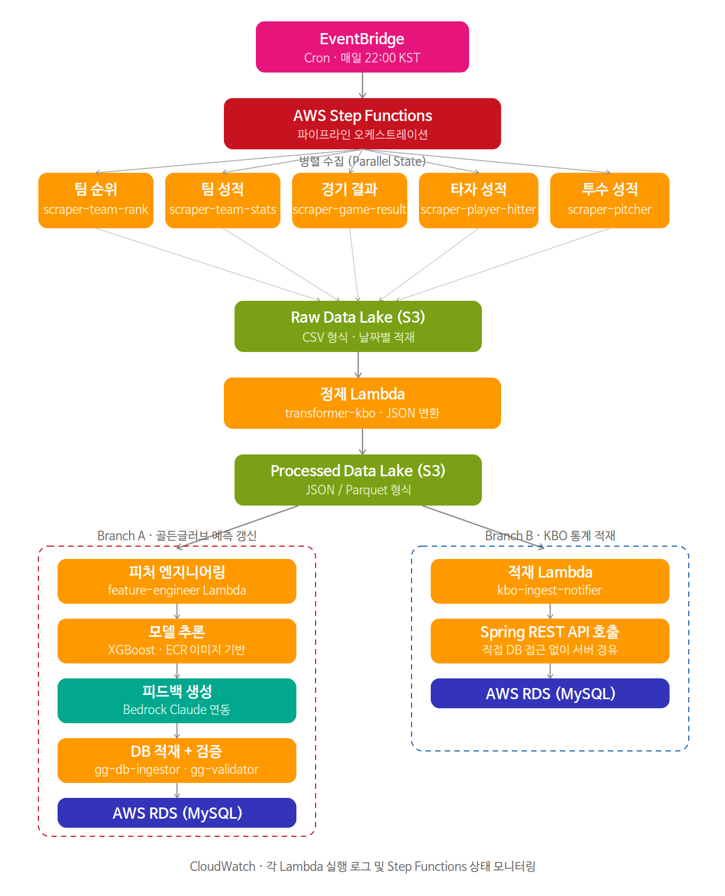
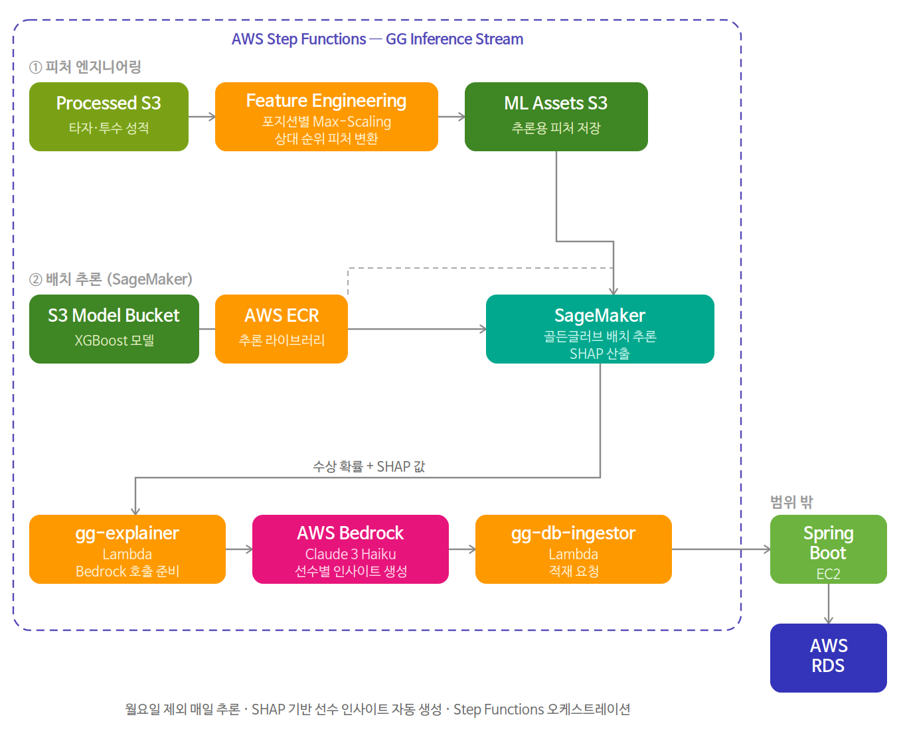
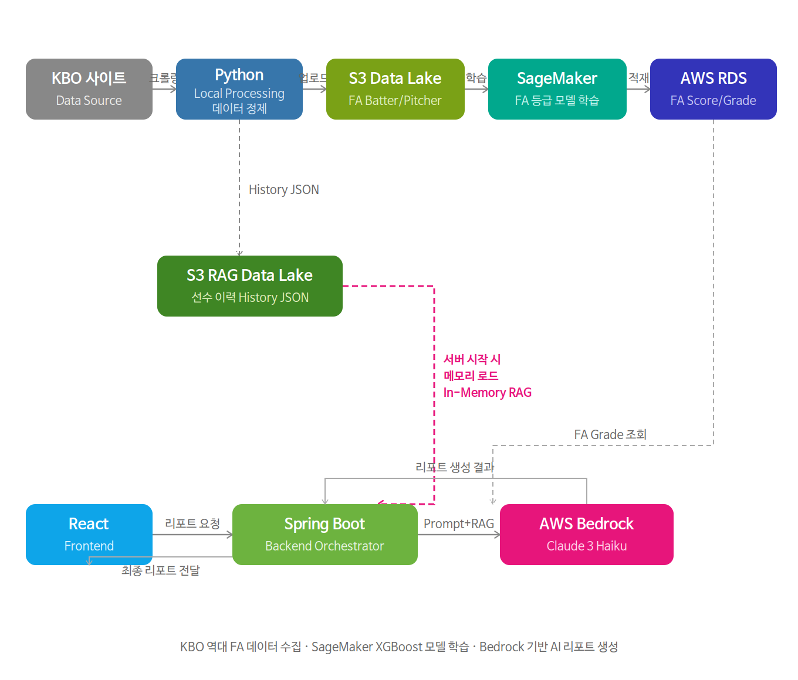
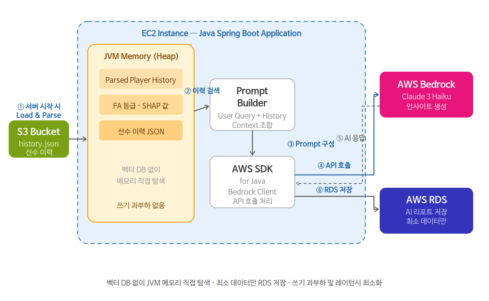
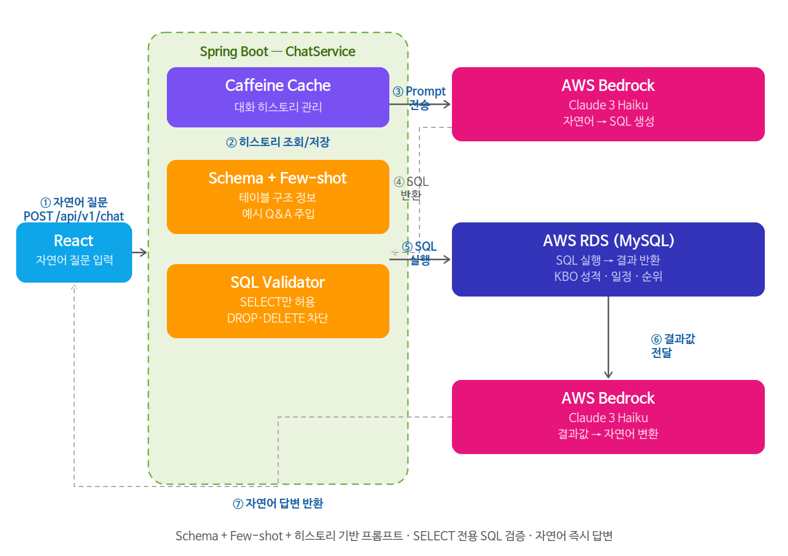

<div align="center">


# 더그아웃 (Dugout) — KBO 데이터 인사이트 플랫폼

> **"관중석이 아닌, 더그아웃의 시선으로."**  
> 10개 구단 모든 데이터의 중심. 실시간 트래킹부터 미래 성적 예측까지, 야구를 꿰뚫는 새로운 시각.

🌐 **서비스 바로가기** : [dugout.cloud](https://dugout.cloud)  
📄 **API 문서 (Swagger)** : [dugout.cloud/swagger-ui/index.html](https://dugout.cloud/swagger-ui/index.html)

</div>

---

## 📌 목차

1. [왜 이 프로젝트를 만들었나](#1-왜-이-프로젝트를-만들었나)
2. [서비스 소개](#2-서비스-소개)
3. [기술 스택 & 선택 이유](#3-기술-스택--선택-이유)
4. [시스템 아키텍처](#4-시스템-아키텍처)
   - 4-1. 데이터 파이프라인 (일별 크롤링 → DB)
   - 4-2. 선수 미래 성적 예측 ML 파이프라인
   - 4-3. FA 등급 분석 ML & GenAI 파이프라인
   - 4-4. Insight Engine (In-Memory RAG)
   - 4-5. KBO 챗봇 (Text-to-SQL RAG)
   - 4-6. 팀 추천 파이프라인
5. [AI/ML 모델링](#5-aiml-모델링)
6. [프로젝트 구조](#6-프로젝트-구조)
7. [기술적 의사결정 & 트러블슈팅](#7-기술적-의사결정--트러블슈팅)
8. [회고](#8-회고)

---

## 1. 왜 이 프로젝트를 만들었나

### 🔍 문제 인식

KBO 관련 데이터는 공식 홈페이지, 각종 커뮤니티, 뉴스 등 다양한 곳에 **분산**되어 있습니다.  
팬 입장에서 "이 선수가 올 시즌 얼마나 잘할까?", "FA 시장에서 이 선수 가치는?" 같은 질문에  
데이터 기반으로 답을 내려주는 **통합 플랫폼이 없었습니다.**

또한 야구를 처음 접하는 팬들에게는 **"내가 어느 팀을 응원해야 할까?"** 라는 물음 자체도 어렵습니다.

### 💡 해결 방향

> 단순 기록 조회를 넘어, **데이터 수집 → 정제 → 모델링 → 인사이트 제공** 전 과정을 직접 설계하고 구현한다.

- KBO 데이터를 **매일 자동 수집·정제**하여 DB에 적재 (하루 수집 데이터: 타자 269 · 투수 231 · 일정 135 · 팀 20 · **총 655건**)
- **ML 모델 3종** (선수 성적 예측, FA 등급 분석, 골든글러브 예측) 으로 예측 인사이트 제공
- 예측 결과의 **근거를 GenAI로 자동 설명** (In-Memory RAG)
- **자연어로 KBO 데이터 질의** (Text-to-SQL RAG)
- 취향 데이터 기반 **팀 추천** 으로 새 팬 유입 유도

---

## 2. 서비스 소개

더그아웃은 3개의 대카테고리, 총 9개의 메뉴와 개인화 대시보드로 구성되어 있습니다.

### 📊 나의 대시보드
회원가입 시 선택한 응원 팀을 기반으로 **개인화된 홈 화면**을 제공합니다.

| 구성 요소 | 내용 |
|-----------|------|
| 팀 뉴스 | 내 팀의 최신 속보 및 이슈 |
| 경기 일정 & 결과 | 내 팀의 예정 경기 및 최근 결과 |
| 응원 선수 성적 | 내가 즐겨찾기한 선수의 미래 예측 기록 |
| 팀 타자 성적 | 내 팀 타자 전체 성적 한눈에 확인 |
| 팀 투수 성적 | 내 팀 투수 전체 성적 한눈에 확인 |

> 여러 사이트를 돌아다닐 필요 없이, 로그인 후 첫 화면에서 내 팀에 대한 모든 정보를 한 번에 확인할 수 있습니다.

### 🏟️ Game Data Center
| 메뉴 | 설명 |
|------|------|
| KBO 팀/성적 순위 | 10구단의 팀 순위, 팀 성적, 선수들의 성적을 한 눈에 확인 |
| 경기 일정 & 결과 | 전 구단 경기 일정 및 결과 확인 |
| 실시간 KBO 뉴스 | 구단별 주요 속보와 이슈 큐레이션 |

### 🤖 AI Predictive Insight
| 메뉴 | 설명 |
|------|------|
| 선수 미래 성적 예측 | 타율·OPS·엘리트 투수 등 시즌 종료 시점 성적 시뮬레이션 |
| 골든글러브 수상 예측 | 데이터 기반 수상 확률 랭킹 산출 |
| FA 시장 등급 분석 | 예비 FA 선수의 가치와 리스크를 정량적으로 분석 |
| KBO 챗봇 | 자연어로 KBO 성적·일정·순위를 즉시 질의 |

### 🎉 Fan Experience
| 메뉴 | 설명 |
|------|------|
| 구단별 티켓 예매 | 각 구단 예매 사이트 직링 및 일정 알림 |
| 나의 팀 찾기 | 야구 취향 데이터를 분석해 가장 잘 맞는 구단을 추천 |
| 야구 용어 & 룰 가이드 | 초보부터 마니아까지, 야구를 구조적으로 이해하는 가이드 |

---

## 3. 기술 스택 & 선택 이유

### 🖥️ Frontend
| 기술 | 선택 이유 |
|------|-----------|
| **React (TypeScript / TSX)** | Google AI Studio로 UI 초안을 생성하고, 서버 API 연동·데이터 바인딩 로직은 직접 수정하여 완성. 컴포넌트는 TSX 기반으로 타입 안정성을 확보하면서 컴포넌트 단위로 UI를 독립적으로 관리 |
| **Tailwind CSS** | 유틸리티 클래스 기반으로 빠르게 반응형 UI를 구성. 별도 CSS 파일 없이 일관된 스타일 유지 |

### ⚙️ Backend
| 기술 | 선택 이유 |
|------|-----------|
| **Java 17 + Spring Boot 3.x** | 안정적인 서버 운영과 타입 안정성. 다수의 API 엔드포인트를 구조적으로 관리하기 위해 선택 |
| **JPA / QueryDSL** | 복잡한 선수·경기 데이터 조회를 타입 세이프하게 작성하기 위해 QueryDSL 병행 사용 |
| **JWT** | 사용자 인증 시 토큰을 HTTP 헤더에 포함시켜 요청마다 서버에서 검증하는 Stateless 인증 방식 구현 |
| **Caffeine Cache** | Text-to-SQL 챗봇의 대화 히스토리 유지 및 API 토큰 최적화. 인메모리 캐시로 DB 조회 없이 대화 맥락 관리 |
| **SQL Validator** | LLM이 생성한 SQL의 DDL/DML 실행을 차단하여 LLM 인젝션 위협 원천 방지. SELECT 전용 쿼리만 허용 |

### 🤖 AI/ML/Data
| 기술 | 선택 이유 |
|------|-----------|
| **Python 3.12** | ML 생태계(scikit-learn, XGBoost, pandas, SHAP 등)가 가장 성숙한 언어 및 버전 |
| **XGBoost** | 모든 모델링에서 핵심 알고리즘으로 사용. 야구 데이터는 변수 간 관계가 비선형이며 불연속성이 크기 때문에, 트리 기반 구조로 복잡한 패턴을 효과적으로 포착. 자체 규제(Regularization) 기능으로 과적합 방지 |
| **앙상블 (XGBoost + RandomForest + ExtraTrees)** | 선수 미래 성적 예측에서 거포 타자와 컨택 타자 간 예측 오차 편차 문제 발생. 여러 트리 기반 모델을 앙상블하여 특정 타자 유형에 편향되지 않는 안정적인 예측 성능 확보 |
| **scikit-learn** | 앙상블 모델 구성 및 전처리 파이프라인 구현 |
| **SHAP** | 모델이 왜 이 예측을 했는지 설명 가능성(XAI) 확보. 단순 예측을 넘어 근거를 제공하기 위한 핵심 도구 |
| **BeautifulSoup4** | KBO 데이터 크롤링. 정적 HTML 파싱에 적합하고 Python 생태계와 자연스럽게 연동. Lambda 용량 제한(250MB) 내에서 커스텀 Layer로 경량화 |

### ☁️ AWS Cloud
| 기술 | 선택 이유 |
|------|-----------|
| **EC2 (t2.micro -> t3.small)** | 서비스 서버 호스팅 및 Docker DB 통합 운영. RDS 제거를 통해 전체 고정 비용을 최적화하고, 최소한의 비용으로 중단 없는 배포 환경을 보장. (26.06.24)|
| **RDS (MySQL)** | 선수·경기·예측 결과 등 정형 데이터의 안정적인 영구 저장소 /(26.06.24) rds 해체 |
| **Amazon S3** | 대용량 KBO 원천 데이터 및 정제 데이터 저장. Parquet 포맷으로 분석용, JSON 포맷으로 조회용 이원화 적재 |
| **AWS Lambda** | 크롤링·정제·피처 엔지니어링·리포트 생성 등 파이프라인 각 단계를 독립 함수로 구성. 실행 시에만 비용 발생 |
| **AWS Step Functions** | Lambda 함수를 병렬·순차 실행으로 조율하는 파이프라인 오케스트레이터. 상태 머신으로 재실행 및 에러 핸들링 명확하게 처리. 프리 티어 내에서 오케스트레이션 비용 0원으로 운영 |
| **Amazon EventBridge** | Step Functions를 매일 일정 시각에 자동 트리거하는 cron 스케줄러 |
| **Amazon ECR** | ML 모델 실행 환경을 Docker 이미지로 패키징 저장. 모델 환경 재현성 보장 |
| **AWS Glue (Crawler/Catalog)** | S3 데이터의 메타데이터 관리 및 Parquet 변환. Glue 카탈로그 재구성으로 Athena 스캔량 43.4% 감소·실행시간 23% 단축 |
| **Amazon Athena** | S3 데이터를 SQL로 직접 조회. Partition Pruning 유도로 스캔량 최적화 |
| **Amazon SageMaker (ml.t3.medium)** | ML 모델 학습 및 배치 추론 환경. 로컬 리소스 제약 없이 안정적인 학습·추론 환경 확보 |
| **Amazon Bedrock (Claude 3 Haiku)** | GenAI 기반 AI 리포트 생성. 자체 모델 서빙 없이 Claude를 API 형태로 바로 연결 |
| **Amazon CloudWatch** | 각 Lambda 함수와 Step Functions 실행 로그를 실시간 모니터링 |
| **Amazon SNS** | 골든글러브 모델 검증 이상 감지 시 즉시 알림 발송 |

### 🔧 DevOps
| 기술 | 선택 이유 |
|------|-----------|
| **GitHub Actions** | 코드 푸시 시 자동 빌드·배포 파이프라인 구성 |
| **Docker** | ML 모델 실행 환경을 이미지로 패키징하여 ECR에 업로드, 환경 재현성 보장 |
| **Nginx** | EC2 앞단의 리버스 프록시. 포트 라우팅 및 정적 파일 서빙 |
| **VPC** | 퍼블릭·프라이빗 서브넷 분리로 RDS 등 내부 리소스 네트워크 격리 |

---

## 4. 시스템 아키텍처

### 4-1. 데이터 파이프라인 — 일별 크롤링 → DB

> **왜 이 구조인가?**  
> KBO 데이터는 경기 당일 갱신되므로 **매일 자동 수집**이 필수입니다.  
> Step Functions 상태 머신으로 각 단계를 오케스트레이션하여 특정 Lambda가 실패해도 재실행이 가능하고,  
> 병렬 처리로 수집 시간을 단축했습니다.  
> 수집 → 정제 → 적재 / 골든글러브 예측 갱신까지 전 과정이 하나의 자동화된 흐름으로 연결됩니다.



**파이프라인 실행 흐름**

```
EventBridge (cron · 매일 22:00 KST)
    └─▶ Step Functions 트리거
            │
            ├─▶ [병렬 수집 - Parallel State] Lambda × 5 동시 실행
            │       ├─ scraper-team-rank   (팀 순위)
            │       ├─ scraper-team-stats  (팀 성적)
            │       ├─ scraper-game-result (경기 결과)
            │       ├─ scraper-player-hitter (타자 성적)
            │       └─ scraper-pitcher     (투수 성적)
            │
            └─▶ 정제 Lambda (transformer-kbo · JSON 변환 → S3 저장)
                    │
                    ├─▶ [Branch A] 골든글러브 예측 갱신
                    │       ├─ 피처 엔지니어링 Lambda (feature-engineer-lambda)
                    │       ├─ 모델 추론 (SageMaker · ECR 이미지 기반 · SHAP 산출)
                    │       ├─ AI 리포트 생성 Lambda (gg-explainer · Bedrock 연동)
                    │       ├─ DB 적재 Lambda (gg-db-ingestor)
                    │       └─ 모델 검증 Lambda (gg-validator · 2026.05.07 추가)
                    │
                    └─▶ [Branch B] KBO 통계 적재
                            └─ Spring REST API 호출 (kbo-ingest-notifier) → RDS 저장
```

**설계 포인트**

- **병렬 수집**: Parallel State로 5개 도메인 동시 수집, 전체 수집 시간 단축
- **파이프라인 원자성**: 미등록 선수 감지 시 missing-player-scraper Lambda 동적 호출 및 선적재 구조로 데이터 무결성 보장
- **병렬 분기**: ML/GenAI 추론(Branch A)과 DB 통계 적재(Branch B)를 독립 분기로 분리, 상호 간섭 없이 병렬 실행
- **모니터링**: CloudWatch로 각 Lambda 실행 로그 및 Step Functions 상태 모니터링

> **2026.05.07 모니터링 강화**  
> `dugout-gg-validator` Lambda를 파이프라인에 추가. DB 적재 완료 후 포지션 누락, 예측 확률 이상, SHAP 기여도 결손 등 총 10개 항목을 자동 점검. 이상 감지 시 SNS 즉시 알림 발송. 검증 실패 여부와 무관하게 파이프라인 실행은 중단되지 않음.

---

### 4-2. 선수 미래 성적 예측 — ML & GenAI 파이프라인

> **왜 이 구조인가?**  
> 실시간 추론 방식이 아닌, 시즌 전 10년치 역대 데이터를 학습하여 다음 시즌 성적을 미리 예측하는 배치 구조입니다.  
> 예측 결과는 RDS에, SHAP 기반 설명 데이터는 S3 → Java 힙 메모리에 올려두어  
> 프론트 요청 시 **예측값 + 자연어 AI 리포트를 한 번에 반환**하는 흐름으로 설계했습니다.



**모델 구성**

| 구분 | 예측 타겟 | 비고 |
|------|-----------|------|
| 타자 XGBoost | 타율, HR, OPS | 회귀 문제 |
| 투수 XGBoost | 다음 시즌 엘리트 등극 확률 | 분류 문제 |

> **왜 투수 모델을 ERA 회귀에서 분류 문제로 전환했나?**  
> ERA는 수비, 운, 타구의 질, 구장, 불펜 승계주자 등 투수가 통제할 수 없는 요소가 너무 많이 섞여 있습니다.  
> 초기 ERA 회귀 모델은 이 노이즈를 감당하지 못하고 붕괴했고,  
> 타겟을 "다음 시즌 엘리트 등극 여부"로 전환하여 모델 안정성을 확보했습니다.

**파이프라인 실행 흐름**

```
[학습 단계 — 시즌 전 1회]
10년치 KBO 역대 데이터
    └─▶ 피처 엔지니어링
            ├─▶ 타자 XGBoost 학습 → 예측 결과 RDS 저장 / SHAP JSON → S3
            └─▶ 투수 XGBoost 학습 → 예측 결과 RDS 저장 / SHAP JSON → S3

[서비스 단계 — 프론트 요청 시]
프론트 요청 (선수 ID)
    └─▶ Spring API
            ├─▶ RDS에서 예측 결과 조회
            └─▶ Java 힙 메모리에서 SHAP JSON 조회 (In-Memory RAG)
                    └─▶ Bedrock으로 자연어 AI 리포트 생성
                            └─▶ 예측값 + AI 리포트 단일 응답 반환
```

---

### 4-3. FA 등급 분석 — ML & GenAI 파이프라인

> **KBO FA 등급 제도의 한계에서 출발했습니다.**  
> KBO FA 등급(A/B/C)은 최근 3년 평균 연봉 기준으로 분류되는 제도적 구조입니다.  
> 연봉은 과거 장기 계약, 팀 내부 연봉 구조, 포지션 희소성 등 경기력 외 요소에도 영향을 받습니다.  
> "경기력 데이터로 등급을 다시 산출하면 어떤 결과가 나올까?" 라는 질문에서 시작했습니다.



**모델 구성**

10년치 KBO 역대 데이터로 학습, **2026·2027년 FA 자격 예정 선수** 대상으로 등급 예측.  
A / B / C 3단계 **다중 클래스 분류 문제**로 설계, XGBoost Classifier 사용.

**피처 설계 — 공격 지표**

단순 타율이 아닌 **공격 생산 구조**를 점수화. OPS, 득점권 생산성(RISP), 장타 생산력, 시즌별 타격 퍼포먼스 등 종합.

**피처 설계 — 수비 지표 (차별점)**

멀티 포지션 소화 가능 여부(유틸리티 자원 여부)를 크롤링 단계에서 별도 수집하여 수비 가치 가산 요소로 반영.  
수비 점수는 단순 실책 수가 아닌 **수비 수행 능력 + 포지션 가치 + 유틸리티 활용 가능성** 포함.

**파이프라인 실행 흐름**

```
[학습 단계 — 시즌 전 1회]
10년치 KBO 역대 데이터
    └─▶ 피처 엔지니어링 (공격 점수 + 수비 점수 + 유틸리티 여부)
            └─▶ XGBoost Classifier 학습 (A/B/C 다중 분류)
                    ├─▶ 26·27년 FA 예정 선수 등급 예측 → RDS 저장
                    └─▶ SHAP JSON 생성 → S3 업로드

[서비스 단계 — 프론트 요청 시]
프론트 요청 (선수 ID)
    └─▶ Spring API
            ├─▶ RDS에서 FA 등급 조회
            └─▶ Java 힙 메모리에서 SHAP JSON 조회 (In-Memory RAG)
                    └─▶ Bedrock으로 자연어 AI 리포트 생성
                            └─▶ FA 등급 + AI 리포트 단일 응답 반환
```

---

### 4-4. Insight Engine — In-Memory RAG

> **왜 이 구조인가?**  
> 벡터 DB나 외부 스토리지를 두면 인프라 비용과 레이턴시가 발생합니다.  
> 이 프로젝트에서 설명의 원천 데이터는 **각 선수의 SHAP 값**으로,  
> 선수 고유 ID로 즉시 조회 가능한 1:1 매칭 정형 데이터입니다.  
> 따라서 임베딩 검색이 필요 없고, SHAP JSON을 **Java 힙 메모리에 올려두고**  
> 요청 시 선수 ID로 탐색해 Bedrock에 직접 전달하는 **정적 In-Memory RAG** 구조를 선택했습니다.  
> 벡터 DB 없이 빠르고 저비용으로 AI 리포트 생성이 가능합니다.



```
서버 기동 시: S3에서 SHAP JSON 로드 → JVM 힙 메모리 상주
사용자 요청 → 선수 ID 추출 → 힙 메모리에서 SHAP JSON 탐색
→ 등급(RDS) + SHAP 근거(Memory)를 프롬프트로 결합
→ Bedrock (Claude 3 Haiku) 에 전달 → 자연어 AI 리포트 반환
```

**설계 포인트**

- `@PostConstruct`로 서버 기동 시 SHAP JSON을 JVM 힙에 상주, 이후 요청마다 즉시 탐색
- 벡터 DB 배제: SHAP은 선수 ID 기반 1:1 매칭, 성적 조회는 SQL 조회 영역으로 유사도 검색 불필요
- 쓰기 과부하 없음, 최소 데이터만 RDS 저장으로 레이턴시 최소화

---

### 4-5. KBO 챗봇 — Text-to-SQL RAG

> **왜 이 구조인가?**  
> KBO 성적·일정·순위 데이터는 정형 테이블에 잘 적재된 구조입니다.  
> 자연어를 SQL로 변환해 DB를 직접 조회하는 방식이 벡터 검색보다  
> 정확도가 높고 인프라 비용도 낮습니다.  
> Schema + Few-shot 기반 프롬프트로 SQL 변환 정확도를 높이고,  
> SQL Validator로 LLM 인젝션을 원천 차단했습니다.



```
① 사용자 자연어 질문 입력 (React · POST /api/v1/chat)
② Caffeine Cache에서 대화 히스토리 조회/저장
③ Schema 정보 + Few-shot 예시(S3) + 히스토리 기반 프롬프트 구성
④ Bedrock (Claude 3 Haiku) 에 전달 → SQL 생성
⑤ SQL Validator (SELECT만 허용 · DROP/DELETE 차단)
⑥ AWS RDS 실행 → 결과값 반환
⑦ Bedrock이 결과를 자연어로 변환 → 사용자에게 답변 반환
```

**설계 포인트**

- **SQL Validator**: LLM 인젝션 및 DDL/DML 원천 차단. SELECT 전용 쿼리만 RDS 실행
- **Caffeine Cache**: 대화 히스토리 유지 및 API 토큰 최적화
- **Few-shot S3 격리**: '연승(W3)' 등 엣지케이스 대응을 위한 Few-shot 예시를 S3로 분리. 코드 수정 없이 동적 로드 구조로 배포 독립성 확보
- **Schema 주입**: 테이블 구조 정보를 프롬프트에 포함하여 Text-to-SQL 변환 정확도 확보

---

### 4-6. 팀 추천 파이프라인

> **왜 이 구조인가?**  
> 팀 추천은 ML 모델링이 아닌 **역대 10년치 팀 성적 데이터 + 사용자 가중치 기반 점수 매칭**입니다.  
> S3 → Glue → Athena 서버리스 파이프라인으로 처리하여 인프라 비용을 최소화했습니다.


**파이프라인 실행 흐름**

```
프론트 (6가지 질문 응답 + 가중치)
    └─▶ Spring API
            └─▶ Athena 쿼리 실행 (사용자 가중치 적용 점수 산출)
                    └─▶ 상위 3개 팀 결과 반환
                            └─▶ Bedrock AI 리포트 결합
                                    └─▶ 추천 결과 + AI 리포트 → 프론트
```

**6가지 질문과 점수 설계**

사용자는 홈런·타율·방어율·불펜·OPS·승률 6개 지표에 대해 **1~5점의 가중치**를 선택합니다.

| 지표 | 정규화 기준 | 설계 근거 |
|------|------------|-----------|
| 홈런 (HR) | 234.0 | KBO 팀 단일 시즌 최다 홈런 (2018 SK 와이번스 233개) 기준 |
| 타율 (AVG) | 0.300 | 야구에서 '3할'은 정교함의 상징 |
| 방어율 (ERA) | 5.0 (역산) | `(5.0 - ERA) / 5.0` 역산. 5.0은 투수력 경쟁력 한계선 |
| 불펜 (SV + HLD) | 140.0 | 144경기 기준 매 경기 필승조 가동 수준 |
| OPS | 1.0 | MVP급 성적 기준 |
| 승률 (WPCT) | 1.0 | 전승 기준 |

**Athena 쿼리 — Partition Pruning 유도**

"몇 년도부터 야구를 보기 시작하셨나요?" 질문은 단순 UX가 아닙니다.  
선택한 연도가 `WHERE h.year >= :startYear` 조건으로 주입되어 **Partition Pruning**을 유도합니다.

```
불필요한 S3 데이터 스캔 감소 → Athena 쿼리 비용 절감 → 쿼리 성능 개선
```

---

## 5. AI/ML 모델링

> 각 모델의 상세 실험 과정, 피처 엔지니어링, 성능 비교는 **벨로그 시리즈**에 기록되어 있습니다.  
> 👉 [벨로그 바로가기](https://velog.io/@sudo_be_happy)

### 🏆 골든글러브 수상 예측

**핵심 설계 — 분류에서 랭킹 문제로 재정의**

579건, 수상자 비율 16.9%의 극심한 클래스 불균형 환경에서,  
단순 분류(수상자인가 아닌가)가 아닌 **"누가 가장 위에 올라야 하는가"를 가리는 랭킹 문제**로 재정의했습니다.  
평가 지표도 Accuracy 중심에서 Top-1 Accuracy, NDCG, MRR로 전환했습니다.

**피처 엔지니어링**
- 포지션별 Max-Scaling: 포수와 1루수를 같은 기준으로 평가하지 않도록 리그 내 포지션별 상대 백분위로 변환
- 시즌 진행률 편차 제거: 시즌 초 단 1경기 만에 홈런을 친 선수가 수상 후보로 오분류되는 현상 방지

**클래스 불균형 처리 — A/B 테스트**

| 구분 | SMOTE | scale_pos_weight |
|------|-------|-----------------|
| Precision | 0.7368 | 0.6667 |
| Recall | 0.7778 | 0.7778 |
| **Top-1 Accuracy** | 0.6923 | **0.7692 🔥** |
| NDCG | 0.8789 | 0.8821 |
| MRR | 0.8269 | 0.8526 |

SMOTE가 분류 성능은 높지만, 현실에 없는 합성 선수를 생성해 모델을 관대하게 만드는 문제가 확인됐습니다.  
사용자에게 매일 수상 예측 1위를 제공하는 서비스 특성상, 덜 틀리는 모델보다 **1등을 정확히 찾는 모델**을 선택했습니다.

**하이퍼파라미터 최적화**
- Optuna 베이지안 최적화: 단 20회 탐색(약 4.48초)만에 최적 조합 도출
- **최종 Top-1 Accuracy: 76.9%**

### 📈 선수 미래 성적 예측

- 타자: 타율, OPS 등 시즌 종료 시점 성적 시뮬레이션
- 투수: 엘리트 투수 여부 이진 분류
- XGBoost + RandomForest + ExtraTrees 앙상블로 타자 유형별 편향 방지
- 연도 기준 시계열 분할 (Train: 2015~2023 / Test: 2024~2025) — 데이터 누수 방지

### 💰 FA 시장 등급 분석

- A / B / C 3단계 다중 분류
- 공격 생산 구조 + 수비 가치 + 유틸리티 활용 가능성 종합 반영
- 연도 기준 시계열 분할로 미래 데이터 누수 원천 방지

---

## 6. 프로젝트 구조

```
com.dev.dugout
├── domain                  # 비즈니스 핵심 로직
│   ├── admin
│   ├── player
│   ├── team
│   └── user
├── global                  # 프로젝트 전역 공통 모듈
│   ├── common
│   ├── config
│   ├── error
│   └── jwt
└── infrastructure          # 외부 서비스 및 기술 인프라 연동
    ├── aws
    │   ├── batch
    │   ├── controller
    │   ├── dto
    │   ├── Repository
    │   ├── s3
    │   ├── service
    │   └── strategy
    └── ml
        ├── entity
        └── repository
```

---

## 7. 기술적 의사결정 & 트러블슈팅

### ✅ 왜 벡터 DB 대신 In-Memory RAG를 선택했나?

SHAP 기반 설명 데이터는 선수 ID로 1:1 조회되는 정형 JSON입니다.  
임베딩 검색이 필요 없고, 추가 인프라 비용도 없으며, 응답 속도도 빠릅니다.  
"기술을 위한 기술"이 아닌 **문제에 맞는 가장 단순한 구조**를 선택했습니다.

### ✅ 왜 팀 추천에 ML 모델링을 하지 않았나?

학습 레이블을 정의하기 어렵고, 취향 데이터 자체가 충분하지 않아  
**규칙 기반 + 쿼리 매칭** 방식이 오히려 더 적합하다고 판단했습니다.

### ✅ 왜 AWS Glue + Athena 조합을 선택했나?

팀 추천 데이터는 매 요청마다 실시간 처리가 불필요합니다.  
Spark 클러스터 없이 서버리스 ETL을 처리하고, S3 데이터를 SQL로 바로 조회하는 조합은  
**낮은 운영 비용과 단순한 구조** 두 가지를 동시에 만족합니다.

### ✅ 왜 Step Functions를 오케스트레이션 도구로 선택했나?

KBO 데이터는 경기 종료 후 업로드되는 구조라 배치 처리가 중심이었고,  
핵심 기준은 선후 관계를 정밀하게 제어하면서도 인프라 비용을 최소화하는 것이었습니다.

- **Kafka**: 데이터 이동만 담당, 흐름 제어 기능 없음
- **MWAA**: 상시 구동 비용 + 환경 생성 20~30분 소요, 소용량 배치에 오버엔지니어링
- **Glue ETL**: Spark 엔진 + 최소 DPU 기본 비용, 소용량 배치에 과스펙
- **Step Functions**: 선후 관계를 상태 머신으로 정밀 제어하면서 실행 시에만 비용 발생 → 하루 한 번 실행 기준으로 **프리 티어 내 오케스트레이션 비용 0원**

### ✅ Athena 스캔 비용 및 성능 최적화

**CSV → Parquet 전환 및 Glue 카탈로그 재구성**
- 스캔량 **43.4% 감소**, 실행시간 **23% 단축**

**입문 연도 WHERE 주입으로 Partition Pruning 유도**
- 팀 추천 풀스캔 발생 → 입문 연도 기반 조건 주입으로 스캔량 **64.6% 감소**

### 🚨 Selenium → BeautifulSoup4 전환 — Lambda 패키지 경량화

**문제 발생**
Selenium Docker 이미지 사용 시 AWS Lambda 용량 제한(250MB) 초과.

**원인 분석**
네트워크 패킷 분석을 통해 드롭다운 동작이 동적 렌더링이 아닌 POST 요청 구조임을 확인.

**해결**
requests + BeautifulSoup4 구조로 전환 및 커스텀 Lambda Layer 직접 빌드로 패키지 경량화.  
Selenium 대비 이미지 용량 대폭 감소, Lambda 250MB 제한 내 정상 실행.

### 🚨 신규 선수 감지 — DB 정합성 문제

**문제 발생**
외국인 선수 교체 및 2군 콜업으로 인해 DB에 미등록된 신규 선수 성적 유입 시 파이프라인 적재 실패.

**원인 분석**
미등록 선수를 그대로 적재 시 FK 제약 위반 및 데이터 정합성 붕괴.

**해결**
예외 감지 시 `missing-player-scraper` Lambda 동적 호출 및 선적재 구조 구축.  
수동 조치 없이 파이프라인 중단 없이 데이터 무결성 자동 유지.

### 🚨 EC2 (t3.micro) OOM 발생 — Swap Memory 비용 최적화

**문제 발생**
서비스 운영 중 무작위 시점에 EC2 Java 프로세스가 강제 종료(`Killed`).  
11시 파이프라인 가동 시 유입된 대량 데이터 작업의 잔재가 메모리에 남아있다가  
OS 백그라운드 루틴이 추가 메모리 요구 시 OOM Killer에 의해 프로세스 종료.

**해결 대안 및 의사결정**
- 인스턴스 업그레이드: 즉시 해결되지만 프리 티어 초과, 비용 최적화 원칙 위배
- **Swap Memory 2GB 구축**: 물리 RAM 권장 가이드라인(RAM의 2배)에 맞춰 `swapfile` 생성 및 자동 마운트 설정

**결과**
추가 인프라 비용 **0원**으로 서버 다운 장애 완전 해소. 24시간 안정적 배치 파이프라인 운영.

---

## 8. 회고

### 잘한 점
- 데이터 수집부터 GenAI AI 리포트 생성까지 **전체 파이프라인을 혼자 설계하고 구현**한 경험
- 각 기술 선택에 명확한 근거를 가지고 결정한 것 (기술을 위한 기술 지양)
- SHAP 기반 In-Memory RAG처럼 **문제에 맞는 가장 단순한 해법**을 찾으려 노력한 것
- 골든글러브 예측을 분류가 아닌 **랭킹 문제로 재정의**하여 서비스 목적에 맞는 모델을 선택한 것
- 모델 검증 Lambda를 파이프라인에 통합하여 **운영 관점의 모니터링**까지 구현한 것

### 아쉬운 점 / 개선 여지
- 모델 성능 지표를 더 다양한 기준으로 검증하지 못한 부분
- 실시간성이 강화되면 Kinesis 등 스트리밍 파이프라인으로 확장 필요
- 사용자 피드백 루프를 추가해 추천 모델을 지속 개선하는 구조로 발전 가능

---

> 📝 **모델링 상세 기록** : 각 모델의 실험 과정, 피처 중요도, 성능 비교는 벨로그 시리즈에 정리했습니다.  
> 👉 [벨로그 바로가기](https://velog.io/@sudo_be_happy)

> 📬 **Contact** : [GitHub](https://github.com/SungChul23) | kimsam0923@gmail.com
